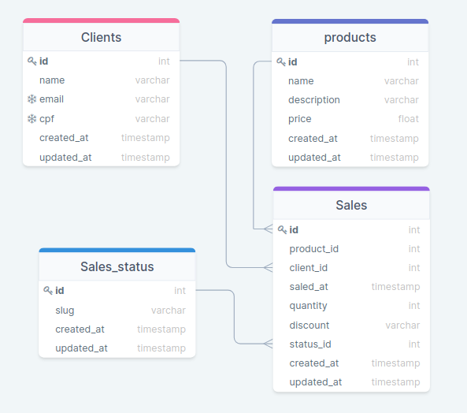

# Desafio Técnico Perfect Pay

> Desafio proposto pela empresa **Perfect pay**, para avaliar os conhecimentos no backend com laravel framework, um sitema de vendas, com crud de produtos, cadastro de cliente e venda final.

## ⚠ Requisitos:

- PHP >= 7.2.5
- Node.Js >= 12.13.1
- NPM >= 6.13.4
- MySQL >= 5.7
- Docker e Docker Compose (opcional)

##### Deve ter o ambiente para o laravel configurado:

- BCMath PHP Extension
- Ctype PHP Extension
- Fileinfo PHP extension
- JSON PHP Extension
- Mbstring PHP Extension
- OpenSSL PHP Extension
- PDO PHP Extension
- Tokenizer PHP Extension
- XML PHP Extension

## Modelagem do Banco de Dados



## ⚡ Mão na massa:

> Você pode realizar o clone deste repositório ou baixar o arquivo .zip!

##### Clone este repositório:

````
git clone https://github.com/huriellopes/perfect-test-backend.git
````

Para baixar o zip: [https://github.com/huriellopes/perfect-test-backend/archive/master.zip](https://github.com/huriellopes/perfect-test-backend/archive/main.zip)

## ✔ Executando a aplicação:

##### Na raiz do projeto, execute os comandos:

````
# Para instalar as dependências do Laravel
componser install
```` 

##### Copie e configure as variaveis de ambiente no arquivo .env:

````
# Para copiar o .env.example para .env
copy .env.example .env ou cp .env.example .env

# Para gerar a key do projeto
php artisan key:generate

# configure as seguintes variaveis de ambiente
DB_CONNECTION=mysql
DB_HOST=127.0.0.1 ou db (container do doker)
DB_PORT=3306
DB_DATABASE=laravel
DB_USERNAME=root
DB_PASSWORD=

# Atenção: Deve ser MySQL e lembre-se de criar o schema/banco!
````

#### Caso queira utilizar docker, rode o seguinte comando:

````
copy docker-compose.example.yml docker-compose.yml ou cp docker-compose.example.yml docker-compose.yml
````

#### Depois configure as variaveis de ambiente no docker compose

````
    environment:
      MYSQL_USER: "root"
      MYSQL_ROOT_PASSWORD: "YOUR_PASSWORD"
      MYSQL_DATABASE: "DATABASE_NAME"

    # O banco de dados está isolado, apenas a aplicação acessa!
````

##### Depois de configurar as variaveis de ambiente, ainda no raiz do projeto, execute os comandos:

````
# Para rodar as migrates e seeds
php artisan migrate --seed

# Caso queira desafazer
php artisan migrate:rollback

# Para rodar o servidor embutido => Caso opte por rodar localmente.
php artisan serve

# Irá executar na seguinte url, abra no navegador
http://localhost:8000

> Caso opte por rodar no docker, acesse no navegador:
http://localhost
````

## Créditos

- Empresa Perfect Pay  - [Site da Empresa](https://perfectpay.com.br)

## 📝 Licença

Este repositório está sob licença MIT. Veja aqui [Licença](license)
